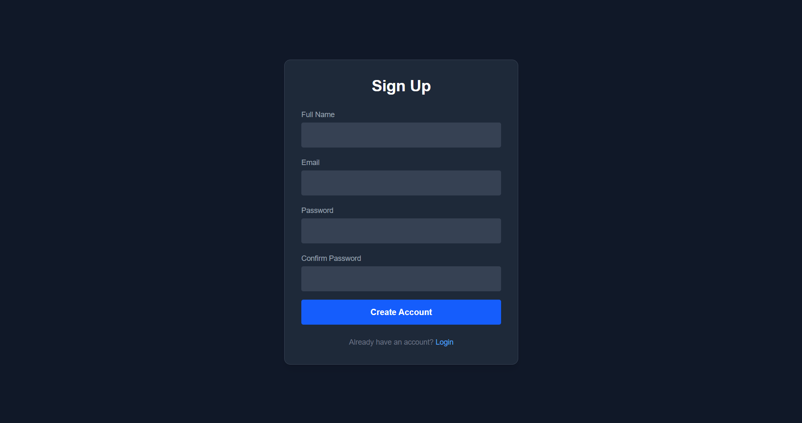
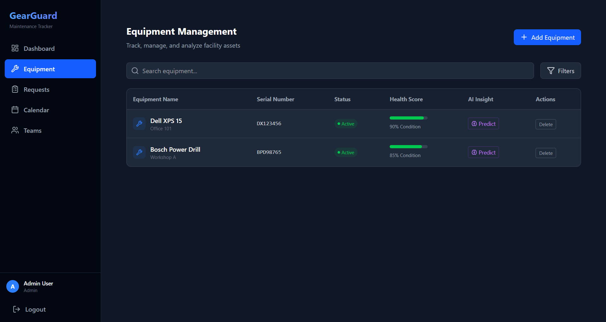

# 🛡️ GearGuard - The Ultimate Maintenance Tracker


## 🚀 Overview

**GearGuard** is a robust, full-stack maintenance tracking application designed to streamline equipment management, maintenance requests, and team coordination. Built with modern web technologies, it offers a seamless experience for Admins, Technicians, and Portal Users to ensure operational efficiency and equipment longevity.

## ✨ Key Features

*   **📊 Interactive Dashboard**: Get a real-time overview of equipment status, pending requests, and team performance.
*   **🛠️ Equipment Management**: Track equipment details, including purchase dates, warranty status, and locations.
*   **🔧 Maintenance Requests**: Submit, assign, and track maintenance requests with priority levels and status updates.
*   **👥 Team Collaboration**: Manage maintenance teams (IT, Mechanical) and assign technicians to specific requests.
*   **🔐 Role-Based Access Control**: Secure access for Admins, Technicians, and Portal Users.
*   **📱 Responsive Design**: Fully optimized for desktop and tablet devices.

## 🛠️ Tech Stack

### Frontend
*   **React** (Vite) - *Fast and modern UI library*
*   **Tailwind CSS** - *Utility-first CSS framework for rapid UI development*
*   **Lucide React** - *Beautiful & consistent icons*
*   **Axios** - *Promise based HTTP client*

### Backend
*   **Node.js & Express** - *Scalable server-side runtime*
*   **Prisma ORM** - *Next-generation Node.js and TypeScript ORM*
*   **SQLite** - *Lightweight, serverless database*
*   **JSON Web Tokens (JWT)** - *Secure authentication*

## 📸 Screenshots

| Sign-Up Page | Equipment Management |
| :---: | :---: |
|  |  |

## 🚀 Getting Started

Follow these steps to set up the project locally.

### Prerequisites
*   Node.js (v18 or higher)
*   npm (v9 or higher)

### Installation

1.  **Clone the repository**
    ```bash
    git clone https://github.com/hilagShah/Odoo-GearGuard.git
    cd Odoo-GearGuard
    ```

2.  **Install Dependencies**
    ```bash
    # Install server dependencies
    cd server
    npm install

    # Install client dependencies
    cd ../client
    npm install
    ```

3.  **Environment Setup**
    Create a `.env` file in the `server` directory:
    ```env
    DATABASE_URL="file:./dev.db"
    PORT=3001
    JWT_SECRET="supersecretkey"
    ```

4.  **Database Setup**
    Initialize the database and seed it with sample data:
    ```bash
    cd server
    npx prisma generate
    npx prisma db push
    node -r dotenv/config seed.js
    ```

5.  **Run the Application**
    Open two terminal windows:

    *   **Terminal 1 (Server)**:
        ```bash
        cd server
        npm run dev
        ```

    *   **Terminal 2 (Client)**:
        ```bash
        cd client
        npm run dev
        ```

6.  **Access the App**
    *   Frontend: [http://localhost:5173](http://localhost:5173)
    *   Backend API: [http://localhost:3001](http://localhost:3001)

### 🔑 Default Credentials

| Role | Email | Password |
| :--- | :--- | :--- |
| **Admin** | `admin@gearguard.com` | `Password@123` |
| **Technician (IT)** | `john@gearguard.com` | `Password@123` |
| **Technician (Mech)** | `jane@gearguard.com` | `Password@123` |

## 🤝 Contributing

Contributions are welcome! Please feel free to submit a Pull Request.

---

Made with ❤️ by the GearGuard Team
